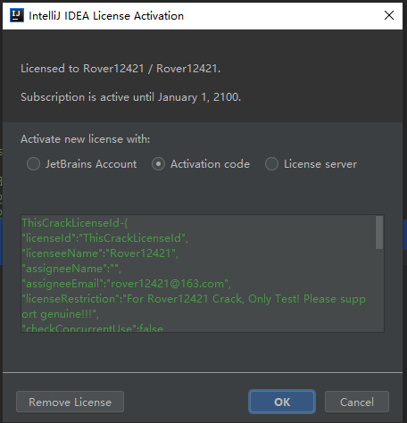
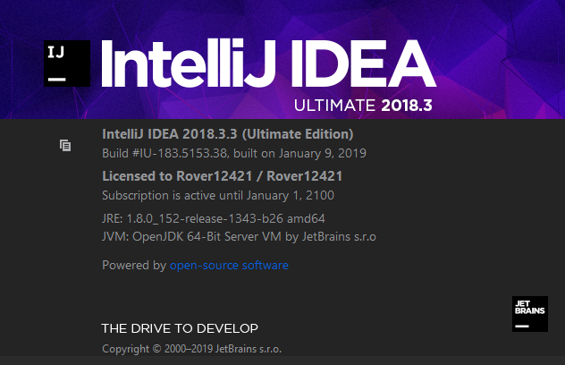

## IDEA 2018.3.3 激活方法永久有效
### 1.下载补丁
（1）2018.11.26 更新–JetBrains系列都可适用（截止IDEA 2018.3.1版本）

    破解补丁：JetbrainsIdesCrack-3.4-release-enc.jar
    百度云地址：https://pan.baidu.com/s/1OXOEFODs65ZlOmvLUaDaBg
    提取码：qf5y

（2）2019.1.14 更新–JetBrains系列都可适用（截止IDEA 最新版本 2018.3.2，2018.3.3）

    破解补丁：JetbrainsIdesCrack-4.2-release.jar
    百度云地址：https://pan.baidu.com/s/1qsghfdHSwC5wvThmcfC0Kg
    提取码：vn7f
### 2.将补丁放到idea的bin目录下
    分别修改bin下的 idea.exe.vmoptions和idea64.exe.vmoptions 这两个文件

    Windows版：-javaagent:C:\SoftWare\ideaIU-2018.3.3.win\bin\JetbrainsIdesCrack-4.2-release.jar

    Mac版：-javaagent:../bin/JetbrainsIdesCrack-4.2-release.jar

    Linux版：-javaagent:../bin/JetbrainsIdesCrack-4.2-release.jar

### 3.开始注册激活
（1）拷贝如下注册码
    ThisCrackLicenseId-{
    "licenseId":"ThisCrackLicenseId",
    "licenseeName":"Rover12421",
    "assigneeName":"",
    "assigneeEmail":"rover12421@163.com",
    "licenseRestriction":"For Rover12421 Crack, Only Test! Please support genuine!!!",
    "checkConcurrentUse":false,
    "products":[
    {"code":"II","paidUpTo":"9998-12-31"},
    {"code":"DM","paidUpTo":"9998-12-31"},
    {"code":"AC","paidUpTo":"9998-12-31"},
    {"code":"RS0","paidUpTo":"9998-12-31"},
    {"code":"WS","paidUpTo":"9998-12-31"},
    {"code":"DPN","paidUpTo":"9998-12-31"},
    {"code":"RC","paidUpTo":"9998-12-31"},
    {"code":"PS","paidUpTo":"9998-12-31"},
    {"code":"DC","paidUpTo":"9998-12-31"},
    {"code":"RM","paidUpTo":"9998-12-31"},
    {"code":"CL","paidUpTo":"9998-12-31"},
    {"code":"PC","paidUpTo":"9998-12-31"}
    ],
    "hash":"2911276/0",
    "gracePeriodDays":7,
    "autoProlongated":false}
    ————————————————
（2）激活如下图

如果激活不成功，记得先“Remove License”
### 4.激活成功

