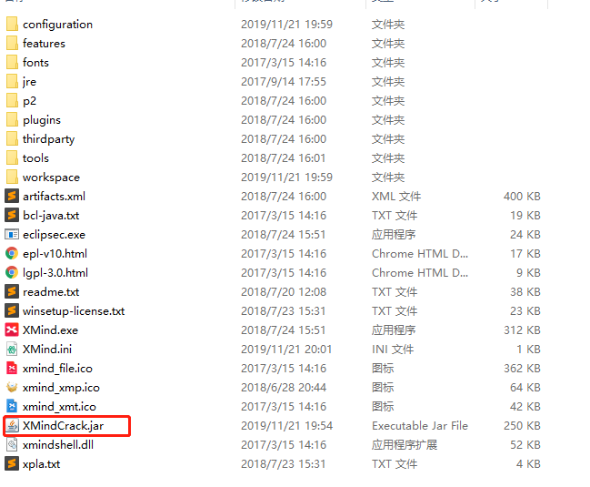
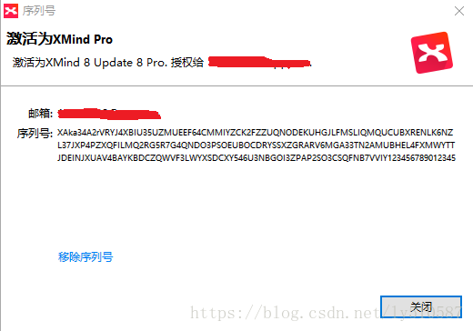
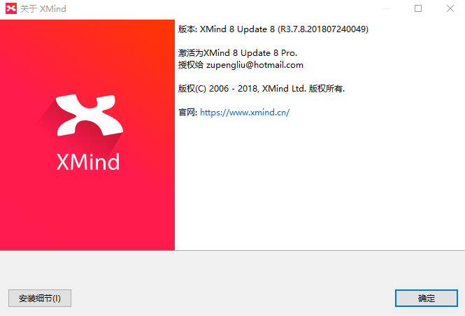

## XMind 8 Update 8下载与补丁激活

### 1、官网下载 XMind 8 Update 8
    https://dl2.xmind.cn/xmind-8-update8-windows.zip
### 2、解压,目录结构如下图
xmind8
### 3、激活，破解工具包下载地址
链接：[XMindCrack.Jar](https://pan.baidu.com/s/1kia0-rkR5TzXRYcB6sF5hw)或者 https://pan.baidu.com/s/1kia0-rkR5TzXRYcB6sF5hw
提取码：qjhx

（1）、下载了XMindCrack.jar之后可将其放在XMind 8 Update 8的目录下，然后修改XMind.ini文件，在文件最后一行添加上：

    -javaagent:E:/software2/XMind 8 Update 8/XMindCrack.jar

（2）、修改本机的hosts文件

    hosts 文件中添加 0.0.0.0 www.xmind.net以阻止 XMind 联网

（3）、打开 XMind, 选择“帮助-序列号”，输入邮箱地址（可随意填写）和下面的序列号激活软件

    序列号：XAka34A2rVRYJ4XBIU35UZMUEEF64CMMIYZCK2FZZUQNODEKUHGJLFMSLIQMQUCUBXRENLK6NZL37JXP4PZXQFILMQ2RG5R7G4QNDO3PSOEUBOCDRYSSXZGRARV6MGA33TN2AMUBHEL4FXMWYTTJDEINJXUAV4BAYKBDCZQWVF3LWYXSDCXY546U3NBGOI3ZPAP2SO3CSQFNB7VVIY123456789012345

点击验证，如下图：

  

打开“帮助-关于XMind”,显示激活为XMind 8 Update 8 Pro，如下图所示：
  
