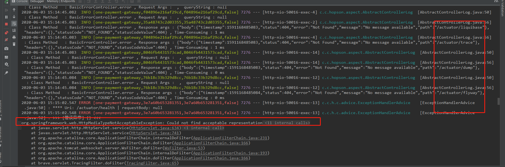

## springboot多模块项目下，子模块调用报错：程序包xxxxx不存在

### 1. 场景描述

今天在用springboot搭建多模块项目，结构中有一个父工程Parent  一个通用核心工程core 以及一个项目工程A

当我在工程A中引入core时，没有问题，maven install正常

当我在工程A中使用core的类时，编译器没有报错，但是在maven install时就会报如下错误：

Failed to execute goal org.apache.maven.plugins:maven-compiler-plugin:2.3.2:compile (default-compile) on project A: Compilation failure: Compilation failure:
[ERROR] xxxxxController.java:[3,29] 错误: 程序包core.xx不存在
[ERROR]xxxxxController.java:[4,29] 错误: 程序包core.xx不存在


### 2. 解决方案：

最后发现原因是父工程使用的是springboot插件

```xml
<plugin>
<groupId>org.springframework.boot</groupId>
<artifactId>spring-boot-maven-plugin</artifactId>
</plugin>
```

把父工程中该插件删除，然后在具体的项目工程添加该插件，就正常了

## actuator 工具提示HttpMediaTypeNotAcceptableException: Could not find acceptable representation

### 问题描述



### 新增mediaType

```java
fastMediaTypes.add(MediaType.valueOf("application/vnd.spring-boot.actuator.v2+json"));
```

#### 解决方案，完整示例如下：

```java
@Configuration
@Slf4j
public class WebConfig implements WebMvcConfigurer {

    public HttpMessageConverter fastConverter() {
        //1、定义一个convert转换消息的对象
        FastJsonHttpMessageConverter fastConverter = new FastJsonHttpMessageConverter();
        //2、添加fastjson的配置信息
        FastJsonConfig fastJsonConfig = new FastJsonConfig();
        fastJsonConfig.setSerializerFeatures(SerializerFeature.PrettyFormat,
                SerializerFeature.WriteNullStringAsEmpty,   //字符串null返回空字符串
                SerializerFeature.WriteNullListAsEmpty,     //空字段保留
                SerializerFeature.WriteMapNullValue);
        fastJsonConfig.setCharset(Charset.forName("UTF-8"));
        //2-1 处理中文乱码问题
        List<MediaType> fastMediaTypes = new ArrayList<>();
        fastMediaTypes.add(MediaType.APPLICATION_JSON_UTF8);
        //解决 actuator 工具提示HttpMediaTypeNotAcceptableException: Could not find acceptable representation
        fastMediaTypes.add(MediaType.valueOf("application/vnd.spring-boot.actuator.v2+json"));
        fastConverter.setSupportedMediaTypes(fastMediaTypes);
        //3、在convert中添加配置信息
        fastConverter.setFastJsonConfig(fastJsonConfig);
        fastConverter.setDefaultCharset(Charset.forName("UTF-8"));
        return fastConverter;
    }

    @Override
    public void extendMessageConverters(List<HttpMessageConverter<?>> converters) {
        converters.clear();
        converters.add(fastConverter());
    }
}
```

