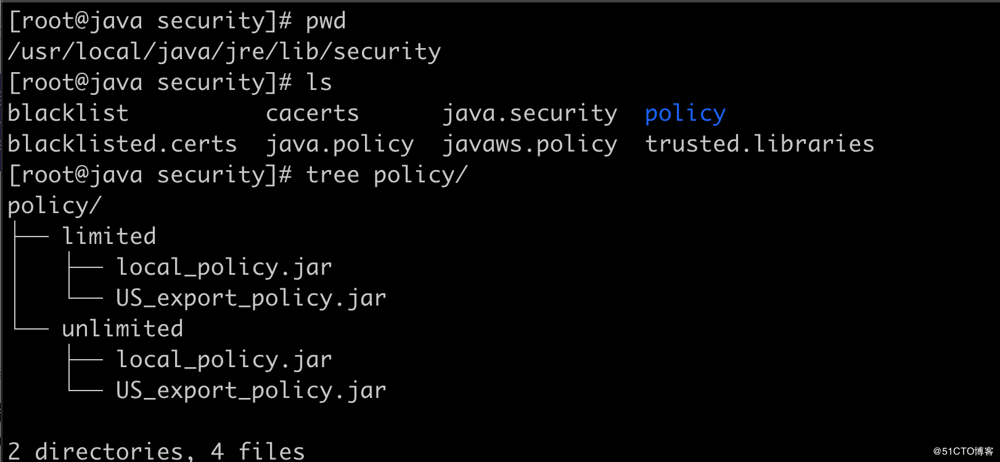

### Java实现AES加密,异常java.security.InvalidKeyException: Illegal key size
#### 场景描述
    微信服务商版本
    对接微信退款接口，退款异步通知，解密<req_info>节点数据时抛出如下异常信息
#### 微信异步通知数据案例
```xml
微信支付-异步通知:
<?xml version="1.0" encoding="UTF-8"?>
<xml>
  <return_code>SUCCESS</return_code>
  <appid><![CDATA[wxf15da9d0f818cfe9]]></appid>
  <mch_id><![CDATA[1525917691]]></mch_id>
  <sub_appid><![CDATA[wx7cfae6c338021cdb]]></sub_appid>
  <sub_mch_id><![CDATA[1526686851]]></sub_mch_id>
  <nonce_str><![CDATA[3d85e80107d7ccf1ea4a52c92e20f9cb]]></nonce_str>
  <req_info><![CDATA[4rQ30fGcyzkqBz62RcrppCIdAOnDcThfPeWirEFtmq0SL0/8AvDDWqbvamCHLKxgrWhZV2tthrcZb050SHMBGYmJ5Ml/+BoHwEFjoFnSi3l/SCGoJe2u7VfrKhFepU96EK9Snn0x7jfSSccpYd2SQuJqyjfoCPkHxwLptPWSes6Cpnje9R457Pgg2UOSeb441UBj/+evWwo81h36daOgK2YK0zZvaptCLdjKBmUFvnGItrdckEfPND5ZYbJGfXHV9P6E+CInLG5gCgGXxmYFxYg3HJ6uYqRAXVJ9AGPnvMtsHd0mOue0Epe1MkfIazUe5kcJI3YH18fJU3Uj9iVAFpqdX5gnAkcByeCw5Wb5mCr+/G/1mSOgZpT8d6jqD56BAOiKSc3QwheXuED5iPZEgr5rhZlLaCT0AxdKhBWOkzretcPkX5wexKj4/u1Oh6d3APzruP5u4kEC2aUpCX/1I8Db07QEVIE7Pv6YeLCMju81cgI/3K4zGa2JvM7097sKg7KXLFsPzrPCSzXjpcgh/XAo628Psid8l40n4xzuRz6ikvN2bez+XZtcQ6JdULk4BNqHpf5ThRGH8+7rcnSci2bLY8IJMV6HhfEpNLGVyfmQDES+GrpJppYXDLN1H+IUDfKmY+CTUHBAT0G37hBAbx2BMTOfJ8oIhT8uH4MmUQoBFBlcsSEeRHNK85KB5d2uenC45DZ8JEy5ASgS21bghJKpZd9I1X5xw5fw6ZezpCxjFmH5JdRquX2hTNzFUjnr/xNIh5/WK5b3yVyElGzArF7ys1CLTUoN/OnWNkIvIBXM9+Zeiv1+BoxTtBR+uUlzy0p4eG08IJDCjgtf0KqukRhb4YLqj5/s/dlS/B+880YvMiAyK4q1twd0Cmd942iLXRPuwAmnvRe33eQUxN6KkNy1q38/m6FPl5p6NvIApxCsVkTunyA5jHtFEw6PyYWddq0JLatrGj5l2GBrM+v/Z0FMMGHQY+ohTsUDF6rVrd/9vfF5BqHM0ozD360faxp95oFQuicf1Mpm7QW2dwsba/gVI5PsIXK5xAXJEXADEwg=]]></req_info>
</xml>
```
#### 异常堆栈信息
```java
com.github.binarywang.wxpay.exception.WxPayException: 解密退款通知加密信息时出错
	at com.github.binarywang.wxpay.bean.notify.WxPayRefundNotifyResult.fromXML(WxPayRefundNotifyResult.java:63)
	at com.github.binarywang.wxpay.service.impl.BaseWxPayServiceImpl.parseRefundNotifyResult(BaseWxPayServiceImpl.java:158)
	at cn.com.hopson.pay.weixin.service.impl.WxPayNotifyServiceImpl.refundNotify(WxPayNotifyServiceImpl.java:190)
	at cn.com.hopson.pay.weixin.service.impl.WxPayNotifyServiceImpl.notify(WxPayNotifyServiceImpl.java:106)
	at cn.com.hopson.pay.weixin.api.WeiXinController.notify(WeiXinController.java:101)
  此处省略........................

Caused by: java.security.InvalidKeyException: Illegal key size or default parameters
	at javax.crypto.Cipher.checkCryptoPerm(Cipher.java:1026)
	at javax.crypto.Cipher.implInit(Cipher.java:801)
	at javax.crypto.Cipher.chooseProvider(Cipher.java:864)
	at javax.crypto.Cipher.init(Cipher.java:1249)
	at javax.crypto.Cipher.init(Cipher.java:1186)
	at com.github.binarywang.wxpay.bean.notify.WxPayRefundNotifyResult.fromXML(WxPayRefundNotifyResult.java:59)
	... 77 common frames omitted
```
#### 问题原因
    Illegal key size or default parameters 是指密钥长度受限制，
    java运行时环境读到的是受限的policy文件。
    policy文件位于${java_home}/jre/lib/security 目录下。
    因为美国的进口管制限制，Java发布的运行环境包中的加解密有一定的限制，默认不允许256位密钥的AES加解密
#### Java 1.8.0_151以前的版本解决办法
    去除该限制只需下载 Java Cryptography Extension (JCE) Unlimited Strength Jurisdiction Policy Files，
    覆盖上述目录下的对应jar文件(local_policy.jar, US_export_policy.jar)即可。

    下载地址：
    JDK6 http://www.oracle.com/technetwork/java/javase/downloads/jce-6-download-429243.html
    文件名叫：jce_policy-6.zip

    JDK7 http://www.oracle.com/technetwork/java/javase/downloads/jce-7-download-432124.html
    文件名叫：UnlimitedJCEPolicyJDK7.zip

    JDK8 http://www.oracle.com/technetwork/java/javase/downloads/jce8-download-2133166.html
    文件名叫：jce_policy-8.zip
    注意：JDK8的jce_policy-8.zip包只适用于Java 1.8.0_151以前的Java 1.8版本

    下载包的readme.txt 有安装说明，即替换
    ${jdk_home}/jre/lib/security
    ${jre_home}/lib/security
    目录下的 local_policy.jar 和 US_export_policy.jar 文件。

#### Java 1.8.0_151以后的版本解决办法
JDK1.8.0_151及其以后的版本无需去官网下载 local_policy.jar和US_export_policy.jar这两个jar包，只需要修改${java_home}/jre/lib/security/ 这目录下的java.security文件配置即可.

1、说明
从Java 1.8.0_151版本开始，java公司为JVM启用无限制强度管辖策略，有了一种新的更简单的方法。
如果不启用此功能，则不能使用AES-256，启用起来也非常方便。

2、看图


看完图你会发现${java_home}/jre/lib/security/没有了上文提到的local_policy.jar和US_export_policy.jar两个文件，而多了一个policy文件夹，而它的下面还有两个文件夹，在其子文件下面分别都有local_policy.jar和US_export_policy.jar两个文件。
而它的两个子文件夹的含义就是limited(有限制)和unlimited(无限制)，这下我相信你应该明白了。没错，我们直接启动unlimited(无限制)即可。

3、启动unlimited(无限制)

把java.security文件的第826行的注释去掉即可

    crypto.policy=unlimited

4、重启java项目即可
