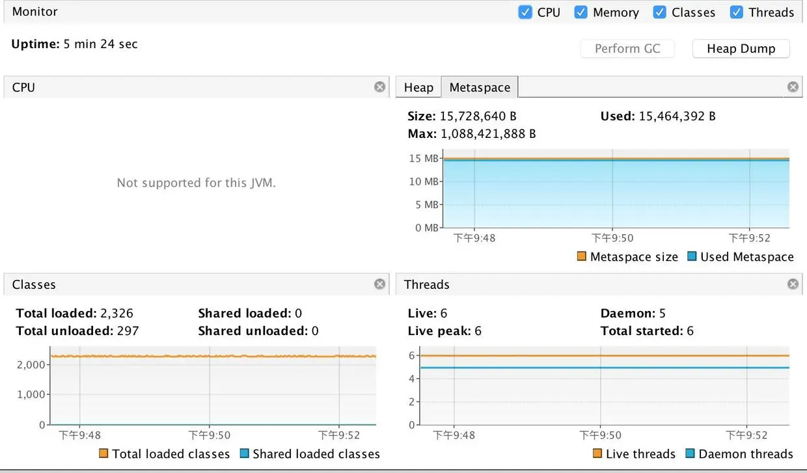
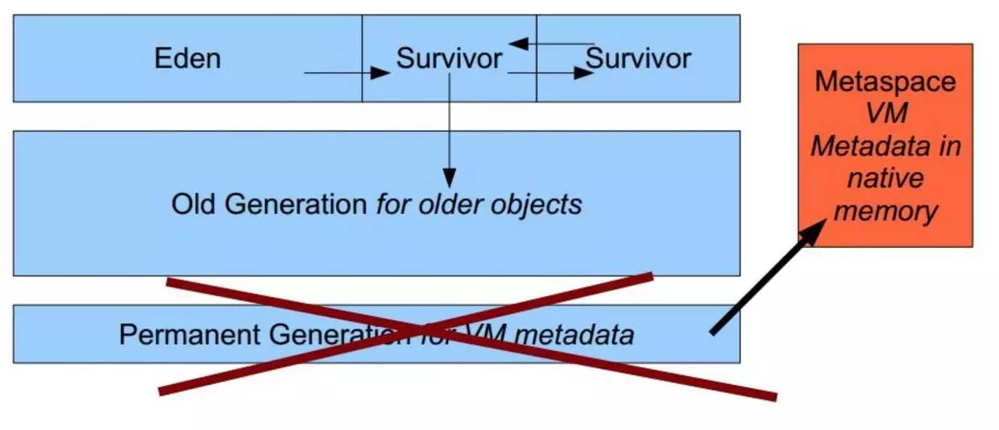

### 前言

因为之前在项目中使用了Groovy对业务进行一些抽象，效果比较好，过程中也踩了一些坑，所以简单记录分享一下自己如何一步一步实现的，在这里你可以了解：1、为什么选用groovy作为规则脚本引擎
1、为什么选择Groovy作为规则引擎
2、了解Groovy的基本原理和Java如何集成
3、分析Groovy与java集成的一些问题和坑
4、在项目中使用时做了哪些性能优化
5、实际使用时需考虑的一些tips

### 规则引擎脚本可解决的问题
1、最为传统的方式是java程序直接写死提供几个可调节的参数配置然后封装成为独立的业务模块组件，  在增加参数或简单调整规则后，重新调上线。
2、使用开源方案，例如drools规则引擎，此类引擎适合业务较复杂的系统
3、使用动态脚本引擎：groovy，simpleEl，QLExpress

### 开源方案选型
  考虑到基于自身的业务的复杂性，传统的开源方案如Acitivities和drools，对于我的业务来说，过于重了。
  再对于脚本引擎来说最常见的其实就是groovy了，ali有一些开源项目 ，对于不同的规则脚本，选型时需要考虑性能、稳定性、语法灵活性，综合考虑下选择Groovy有如下几点原因：

  1. 与java无缝兼容，即使不懂Groovy语法也没关系
  2. 项目周期短，上线时间紧急

### Groovy与Java的集成
Groovy是动态语言，依靠反射方式动态执行表达式的求值，并且依靠JIT编译器，在执行次数够多以后，编译成本地字节码，因此性能非常的高，适应于反复执行的表达式，用Groovy脚本动态调整线上代码，无须发版。

#### (1). GroovyClassLoader
用 Groovy 的 GroovyClassLoader ，它会动态地加载一个脚本并执行它。GroovyClassLoader是一个Groovy定制的类装载器，负责解析加载Java类中用到的Groovy类。
#### (2). GroovyShell
GroovyShell允许在Java类中（甚至Groovy类）求任意Groovy表达式的值。您可使用Binding对象输入参数给表达式，并最终通过GroovyShell返回Groovy表达式的计算结果。
#### (3). GroovyScriptEngine
GroovyShell多用于推求对立的脚本或表达式，如果换成相互关联的多个脚本，使用GroovyScriptEngine会更好些。GroovyScriptEngine从您指定的位置（文件系统，URL，数据库，等等）加载Groovy脚本，并且随着脚本变化而重新加载它们。如同GroovyShell一样，GroovyScriptEngine也允许您传入参数值，并能返回脚本的值。

#### (5).以GroovyClassLoader为例
三种方式都可以实现，现在我们以GroovyClassLoader为例，展示一下如何实现与java的集成：
例如：我们假设申请金额大于20000的订单进入流程B 在SpringBoot项目中maven中引入
```java
<dependency>
            <groupId>org.codehaus.groovy</groupId>
            <artifactId>groovy-all</artifactId>
            <version>2.4.17</version>
</dependency>

```
定义Groovy执行的java接口：
```java
public interface EngineGroovyModuleRule {
    boolean run(Object context);
}

```
抽象出一个Groovy模板文件,放在resource下面以便加载：

```java
import com.groovyexample.groovy.*
class %s implements EngineGroovyModuleRule {
    boolean run(Object context){
        %s //业务执行逻辑：可配置化
    }
}
```

接下来主要是解析Groovy的模板文件，可以将模板文件缓存起来，解析我是通过spring的PathMatchingResourcePatternResolver进行的；下面的StrategyLogicUnit这个String就是具体的业务规则的逻辑，把这一部分的逻辑进行一个配置化。
例如：我们假设执行的逻辑是：申请订单的金额大于20000时，走流程A，代码简单实例如下：
```java
        //解析Groovy模板文件
        ConcurrentHashMap<String,String> concurrentHashMap = new ConcurrentHashMap(128);
        final String path = "classpath*:*.groovy_template";
        PathMatchingResourcePatternResolver resolver = new PathMatchingResourcePatternResolver();
        Arrays.stream(resolver.getResources(path))
                .parallel()
                .forEach(resource -> {
                    try {
                        String fileName = resource.getFilename();
                        InputStream input = resource.getInputStream();
                        InputStreamReader reader = new InputStreamReader(input);
                        BufferedReader br = new BufferedReader(reader);
                        StringBuilder template = new StringBuilder();
                        for (String line; (line = br.readLine()) != null; ) {
                            template.append(line).append("\n");
                        }
                        concurrentHashMap.put(fileName, template.toString());
                    } catch (Exception e) {
                        log.error("resolve file failed", e);
                    }
                });
        String scriptBuilder = concurrentHashMap.get("ScriptTemplate.groovy_template");
        String scriptClassName = "testGroovy";
        //这一部分String的获取逻辑进行可配置化
        String StrategyLogicUnit = "if(context.amount>=20000){\n" +
                "            context.nextScenario='A'\n" +
                "            return true\n" +
                "        }\n" +
                "        ";
        String fullScript = String.format(scriptBuilder, scriptClassName, StrategyLogicUnit);

```
```java
    GroovyClassLoader classLoader = new GroovyClassLoader();
    Class<EngineGroovyModuleRule> aClass = classLoader.parseClass(fullScript);
    //groovy 实体类
    Context context = new Context();
    context.setAmount(30000);
    try {
        EngineGroovyModuleRule engineGroovyModuleRule = aClass.newInstance();
        log.info("Groovy Script returns:{} "+engineGroovyModuleRule.run(context));
        log.info("Next Scenario is {}"+context.getNextScenario());
    }
    catch (Exception e){
       log.error("error...")
    }

```
执行上述代码：
```java
Groovy Script returns: true
Next Scenario is A
```
关键的部分是StrategyLogicUnit这个部分的可配置化，我们是通过管理端UI上展示不同产品对应的StrategyLogicUnit，并可进行CRUD，为了方便配置同时引进了策略组、产品策略复制关联、一键复制模板等功能。

### 集成过程中的坑和性能优化
项目在测试时就发现随着收单的数量增加，进行频繁的Full GC，测试环境复现后查看日志显示：
```java
[Full GC (Metadata GC Threshold) [PSYoungGen: 64K->0K(43008K)] [ParOldGen: 3479K->3482K(87552K)] 3543K->3482K(130560K), [Metaspace: 15031K->15031K(1062912K)], 0.0093409 secs] [Times: user=0.03 sys=0.00, real=0.01 secs]

```
日志中可以看出是mataspace空间不足，并且无法被full gc回收。 通过JVisualVM可以查看具体的情况：

发现class太多了，有2326个，导致metaspace满了。我们先回顾一下metaspace
##metaspace和permgen
这是jdk在1.8中才有的东西，并且1.8讲将permgen去除了，其中的方法区移到non-heap中的Metaspace。

这个区域主要存放：存储类的信息、常量池、方法数据、方法代码等。 分析主要问题有两方面：

问题1：Class数量问题：可能是引入groovy导致加载的类过多了，但实际上项目只配置了10个StrategyLogicUnit，不同的订单执行同一个StrategyLogicUnit时应该对应同一个class。class的数量过于异常。
问题2：就算Class数量过多，Full GC为何没有办法回收？

### Groovy动态加载原理
我们先分析Groovy执行的过程，最关键的代码是如下几部分：
```java
 GroovyClassLoader classLoader = new GroovyClassLoader();
 Class<EngineGroovyModuleRule> aClass = classLoader.parseClass(fullScript);
 EngineGroovyModuleRule engineGroovyModuleRule = aClass.newInstance();
 engineGroovyModuleRule.run(context)

```
GroovyClassLoader是一个定制的类装载器，在代码执行时动态加载groovy脚本为java对象。大家都知道classloader的双亲委派，我们先来分析一下这个GroovyClassloader，看看它的祖先分别是啥：
```groovy
def cl = this.class.classLoader
while (cl) {
    println cl
    cl = cl.parent
}
```
输出
```
groovy.lang.GroovyClassLoader$InnerLoader@13322f3
groovy.lang.GroovyClassLoader@127c1db
org.codehaus.groovy.tools.RootLoader@176db54
sun.misc.Launcher$AppClassLoader@199d342
sun.misc.Launcher$ExtClassLoader@6327fd
```
从而得出：

```groovy
Bootstrap ClassLoader
             ↑
sun.misc.Launcher.ExtClassLoader      // 即Extension ClassLoader
             ↑
sun.misc.Launcher.AppClassLoader      // 即System ClassLoader
             ↑
org.codehaus.groovy.tools.RootLoader  // 以下为User Custom ClassLoader
             ↑
groovy.lang.GroovyClassLoader
             ↑
groovy.lang.GroovyClassLoader.InnerLoader
```
查看关键的GroovyClassLoader.parseClass方法，发现如下代码：

```java
    public Class parseClass(String text) throws CompilationFailedException {
        return parseClass(text, "script" + System.currentTimeMillis() +
                Math.abs(text.hashCode()) + ".groovy");
    }

protected ClassCollector createCollector(CompilationUnit unit, SourceUnit su) {
        InnerLoader loader = AccessController.doPrivileged(new PrivilegedAction<InnerLoader>() {
            public InnerLoader run() {
                return new InnerLoader(GroovyClassLoader.this);
            }
        });
        return new ClassCollector(loader, unit, su);
    }
```
这两处代码的意思是：
  groovy每执行一次脚本，都会生成一个脚本的class对象，这个class对象的名字由 "script" + System.currentTimeMillis() +
Math.abs(text.hashCode()组成，对于问题1：每次订单执行同一个StrategyLogicUnit时，产生的class都不同，每次执行规则脚本都会产品一个新的class。
接着看问题2InnerLoader部分：
  groovy每执行一次脚本都会new一个InnerLoader去加载这个对象，而对于问题2，我们可以推测：InnerLoader和脚本对象都无法在fullGC的时候被回收，因此运行一段时间后将PERM占满，一直触发fullGC。


#### 为什么需要有innerLoader呢？
结合双亲委派模型，由于一个ClassLoader对于同一个名字的类只能加载一次，如果都由GroovyClassLoader加载，那么当一个脚本里定义了C这个类之后，另外一个脚本再定义一个C类的话，GroovyClassLoader就无法加载了。

#### 由于当一个类的ClassLoader被GC之后，这个类才能被GC。
如果由GroovyClassLoader加载所有的类，那么只有当GroovyClassLoader被GC了，所有这些类才能被GC，而如果用InnerLoader的话，由于编译完源代码之后，已经没有对它的外部引用，除了它加载的类，所以只要它加载的类没有被引用之后，它以及它加载的类就都可以被GC了。

#### Class回收的条件（摘自《深入理解JVM虚拟机》）

JVM中的Class只有满足以下三个条件，才能被GC回收，也就是该Class被卸载（unload）：
1、该类所有的实例都已经被GC，也就是JVM中不存在该Class的任何实例。
2、加载该类的ClassLoader已经被GC。
3、该类的java.lang.Class
对象没有在任何地方被引用，如不能在任何地方通过反射访问该类的方法.
一个一个分析这三点：
- 第一点被排除：
查看GroovyClassLoader.parseClass()代码，总结：Groovy会把脚本编译为一个名为Scriptxx的类，这个脚本类运行时用反射生成一个实例并调用它的MAIN函数执行，这个动作只会被执行一次，在应用里面不会有其他地方引用该类或它生成的实例；
- 第二点被排除：
关于InnerLoader：Groovy专门在编译每个脚本时new一个InnerLoader就是为了解决GC的问题，所以InnerLoader应该是独立的，并且在应用中不会被引用；
- 只剩下第三种可能：
该类的Class对象有被引用，继续查看代码：

```java
    /**
     * sets an entry in the class cache.
     *
     * @param cls the class
     * @see #removeClassCacheEntry(String)
     * @see #getClassCacheEntry(String)
     * @see #clearCache()
     */
    protected void setClassCacheEntry(Class cls) {
        synchronized (classCache) {
            classCache.put(cls.getName(), cls);
        }
    }

```
可以复现问题并查看原因：具体思路是无限循环解析脚本，jmap -clsstat查看classloader的情况，并结合导出dump查看引用关系。
所以总结原因是：每次groovy parse脚本后，会缓存脚本的Class，下次解析该脚本时，会优先从缓存中读取。这个缓存的Map由GroovyClassLoader持有，key是脚本的类名，value是class，class对象的命名规则为：
"script" + System.currentTimeMillis() + Math.abs(text.hashCode()) + ".groovy"
因此，每次编译的对象名都不同，都会在缓存中添加一个class对象，导致class对象不可释放，随着次数的增加，编译的class对象将PERM区撑满。

#### 解决方案
大多数的情况下，Groovy都是编译后执行的，实际在本次的应用场景中，虽然是脚本是以参数传入，但其实大多数脚本的内容是相同的。解决方案就是在项目启动时通过InitializingBean接口对于 parseClass 后生成的 Class 对象进行缓存，key 为 groovyScript 脚本的md5值，并且在配置端修改配置后可进行缓存刷新。
这样做的好处有两点：
1、解决metaspace爆满的问题
2、因为不需要在运行时编译加载，所以可以加快脚本执行的速度

### 总结

Groovy适合在业务变化较多、较快的情况下进行一些可配置化的处理，它容易上手：其本质上也是运行在jvm的java代码，我们在使用时需了解清楚它的类加载机制，对于内存存储的基础烂熟于心，并通过缓存解决一些潜在的问题同时提升性能。适合规则数量相对较小的且不会频繁更新规则的规则引擎。


代码示例
本文示例读者可以通过查看下面仓库的中的RuleEngineByGroovy项目：

Github：https://github.com/zupengliu/RuleEngineByGroovy
